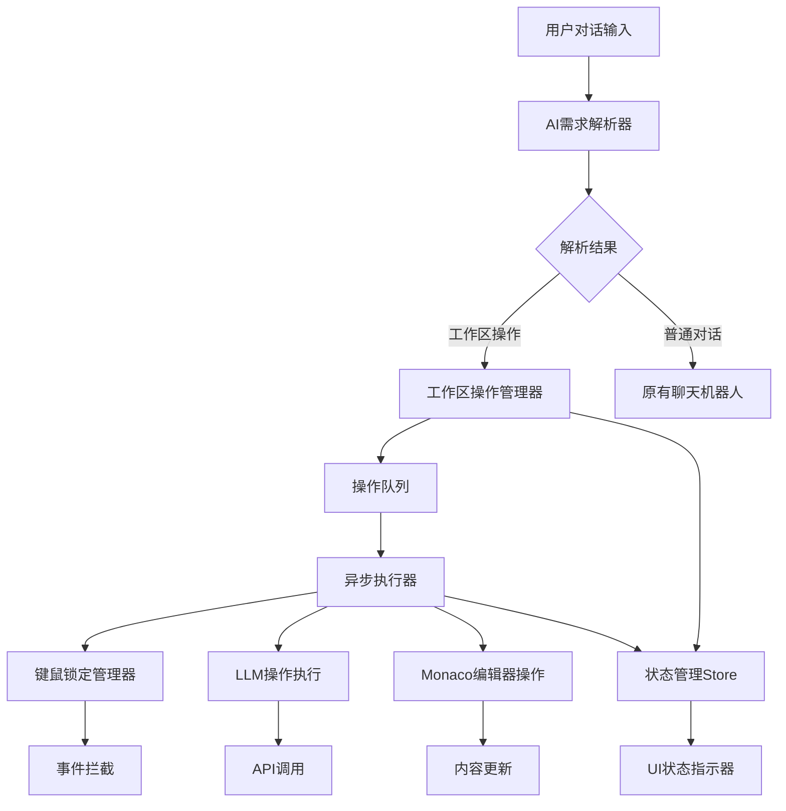

# 工作区AI操作系统 - 技术实现方案

## 📋 项目概述

本项目成功实现了一个完整的工作区AI操作系统，允许用户通过自然语言对话与AI机器人交互，操作工作区，支持异步操作队列、键鼠锁定机制等高级功能。

## ✨ 核心功能特性

### 1. 智能对话操作
- **自然语言解析**：自动识别用户意图（编辑、格式化、生成、分析等）
- **高置信度匹配**：基于关键词和上下文的智能匹配算法
- **多种操作类型**：支持20+种常见工作区操作命令

### 2. 异步操作管理
- **操作队列系统**：支持多个AI操作并发执行
- **优先级调度**：根据操作重要性自动排序
- **状态跟踪**：实时监控操作进度和状态
- **错误处理**：完善的异常处理和回滚机制

### 3. 键鼠锁定机制
- **自动锁定**：AI操作期间自动锁定键盘和鼠标
- **选区保护**：确保LLM操作期间选区不被意外改变
- **智能解锁**：操作完成后自动解除锁定
- **强制解锁**：紧急情况下的手动解锁功能

### 4. 状态管理系统
- **Pinia集成**：与现有状态管理无缝集成
- **实时更新**：工作区状态实时同步
- **历史记录**：完整的操作历史和统计
- **导出功能**：支持操作历史导出和分析

## 🏗️ 架构设计

### 系统架构图



### 核心组件

#### 1. **WorkspaceOperator** (工作区操作管理器)
```typescript
// 位置: site/src/composables/workspaceOperator.ts
// 功能: 核心操作管理、事件队列、键鼠锁定
class WorkspaceOperator {
  - operations: Map<string, WorkspaceOperation>
  - operationQueue: WorkspaceOperation[]
  - lockState: LockState
  + addOperation(operation): Promise<string>
  + lockKeyboardMouse(reason): void
  + unlockKeyboardMouse(): void
  + parseAiRequirement(input): AiRequirement
}
```

#### 2. **AiRequirementParser** (AI需求解析器)
```typescript
// 位置: site/src/composables/aiRequirementParser.ts
// 功能: 自然语言解析、意图识别
class AiRequirementParser {
  - commandPatterns: CommandPattern[]
  - contextKeywords: Record<string, string[]>
  + parse(input): ParsedCommand
  + calculateConfidence(pattern, input): number
}
```

#### 3. **WorkspaceStore** (工作区状态管理)
```typescript
// 位置: site/src/composables/stores/workspace.ts
// 功能: 状态管理、事件监听、UI集成
export const useWorkspaceStore = defineStore("workspace", () => {
  + processAiRequest(userInput): Promise<string>
  + updateSelection(text, start, end): void
  + cancelOperation(operationId): boolean
  + getWorkspaceStats(): object
})
```

## 🔧 技术实现细节

### 1. 事件系统设计

#### 键鼠事件拦截
```typescript
// 在WorkspaceOperator中实现
private handleKeyboardEvent(event: KeyboardEvent) {
  if (this.lockState.isLocked && this.lockState.lockType === OperationType.AI_LLM) {
    event.preventDefault()
    event.stopPropagation()
    return false
  }
  // 正常处理
}
```

#### 事件监听注册
```typescript
// 全局事件监听，优先级最高
document.addEventListener('keydown', this.handleKeyboardEvent.bind(this), true)
document.addEventListener('mousedown', this.handleMouseEvent.bind(this), true)
```

### 2. 异步操作队列

#### 操作定义
```typescript
interface WorkspaceOperation {
  id: string
  type: OperationType
  description: string
  priority: number
  payload: any
  status: OperationStatus
  onProgress?: (progress: number) => void
  onComplete?: (result: any) => void
  onError?: (error: Error) => void
}
```

#### 队列处理
```typescript
private async processQueue() {
  while (this.operationQueue.length > 0) {
    const operation = this.operationQueue.shift()!
    await this.executeOperation(operation)
  }
}
```

### 3. AI需求解析算法

#### 命令模式匹配
```typescript
private commandPatterns: CommandPattern[] = [
  {
    keywords: ['编辑', '修改', '改写', '重写', '润色'],
    action: 'edit',
    target: 'selection',
    priority: 10,
    examples: ['编辑这段文字', '修改选中的内容']
  }
  // ... 更多模式
]
```

#### 置信度计算
```typescript
private calculateConfidence(pattern: CommandPattern, input: string): number {
  const keywordRatio = matchedKeywords.length / pattern.keywords.length
  let confidence = 0.4 + (keywordRatio * 0.4)
  
  const keywordDensity = matchedKeywords.length / words.length
  confidence += keywordDensity * 0.2
  
  // 上下文关键词加分
  if (hasContextKeywords) confidence += 0.1
  
  return Math.min(1, confidence)
}
```

## 🎯 集成说明

### 1. 现有组件增强

#### Chatbot组件扩展
```typescript
// site/src/components/shared/Chatbot.vue
async function simulateAssistant(userText: string) {
  // 1. 尝试解析工作区操作
  const parser = useAiRequirementParser()
  const parsedCommand = parser.parse(userText)
  
  if (parsedCommand.type === 'workspace' && parsedCommand.confidence > 0.5) {
    // 2. 执行工作区操作
    const result = await workspaceStore.processAiRequest(userText)
    return
  }
  
  // 3. 回退到普通聊天
  // ... 原有逻辑
}
```

#### Editor组件集成
```typescript
// site/src/components/edit/Editor.vue
const initializeWorkspaceIntegration = () => {
  // 1. 激活AI助手
  workspaceStore.activateAiAssistant()
  
  // 2. 监听操作完成事件
  operator.on('operationComplete', handleOperationComplete)
  
  // 3. 监听锁定状态变化
  operator.on('lockStateChanged', handleLockStateChange)
}
```

#### AiToolbar组件升级
```typescript
// site/src/components/edit/toolbar/AiToolbar.vue
const run = async () => {
  // 1. 优先使用工作区操作管理器
  if (workspaceStore) {
    const operationId = await operator.addOperation({
      type: OperationType.AI_LLM,
      description: `AI工具栏重写`,
      payload: requirement
    })
    return
  }
  
  // 2. 回退到原有实现
  await runLegacyAiOperation(input)
}
```

### 2. 新增UI组件

#### 工作区状态指示器
```vue
<!-- site/src/components/shared/WorkspaceStatusIndicator.vue -->
<template>
  <div v-if="workspaceState.isLocked" class="status-locked">
    <span class="i-ph:lock-duotone animate-pulse"></span>
    <div>工作区已锁定: {{ workspaceState.lockReason }}</div>
  </div>
  
  <div v-else-if="workspaceState.aiProcessing" class="status-processing">
    <span class="i-ph:robot-duotone animate-spin"></span>
    <div>AI正在处理...</div>
  </div>
</template>
```

#### 功能演示组件
```vue
<!-- site/src/components/shared/WorkspaceOperatorDemo.vue -->
<template>
  <div class="workspace-operator-demo">
    <!-- 支持的命令列表 -->
    <!-- 在线演示 -->
    <!-- 当前状态显示 -->
    <!-- 操作历史 -->
  </div>
</template>
```

## 📚 支持的操作命令

### 编辑类操作
- `"编辑这段文字"` → `action: 'edit', target: 'selection'`
- `"修改选中的内容"` → `action: 'edit', target: 'selection'`
- `"重写这一段"` → `action: 'edit', target: 'selection'`
- `"润色这段话"` → `action: 'edit', target: 'selection'`

### 格式化操作
- `"格式化这段代码"` → `action: 'format', target: 'selection'`
- `"把这段文字加粗"` → `action: 'format', target: 'selection', parameters: {style: 'bold'}`
- `"设为标题"` → `action: 'format', target: 'selection', parameters: {style: 'heading'}`
- `"转为列表"` → `action: 'format', target: 'selection', parameters: {style: 'list'}`

### 生成操作
- `"生成一段介绍"` → `action: 'generate', target: 'document'`
- `"续写这段话"` → `action: 'extend', target: 'selection'`
- `"补充内容"` → `action: 'extend', target: 'selection'`

### 分析操作
- `"分析这段文字"` → `action: 'analyze', target: 'selection'`
- `"检查语法错误"` → `action: 'analyze', target: 'selection'`
- `"统计字数"` → `action: 'count', target: 'selection'`

### 翻译操作
- `"翻译成英文"` → `action: 'translate', target: 'selection', parameters: {targetLanguage: 'english'}`
- `"转换为中文"` → `action: 'translate', target: 'selection', parameters: {targetLanguage: 'chinese'}`

## 🚀 使用方式

### 1. 基本使用流程
1. **选择文本**：在Monaco编辑器中选中要操作的文本（可选）
2. **打开聊天**：点击右下角聊天机器人图标
3. **输入指令**：用自然语言描述想要的操作
4. **AI执行**：系统自动识别意图并执行操作
5. **查看状态**：通过右上角状态指示器查看进度

### 2. 高级功能
- **操作队列**：可以连续发送多个操作指令
- **状态监控**：实时查看操作进度和统计
- **历史导出**：导出操作历史进行分析
- **强制解锁**：紧急情况下手动解锁工作区

### 3. 开发集成
```typescript
// 在任何Vue组件中使用
import { useWorkspaceStore } from '~/composables/stores/workspace'
import { useWorkspaceOperator } from '~/composables/workspaceOperator'

const workspaceStore = useWorkspaceStore()
const operator = useWorkspaceOperator()

// 添加自定义操作
await operator.addOperation({
  type: OperationType.CUSTOM,
  description: '自定义操作',
  priority: 1,
  payload: { /* 操作参数 */ }
})
```

## 🔧 配置和扩展

### 1. 添加新的命令模式
```typescript
// 在aiRequirementParser.ts中添加
private commandPatterns: CommandPattern[] = [
  // 现有模式...
  {
    keywords: ['新功能', '自定义'],
    action: 'custom_action',
    target: 'selection',
    priority: 5,
    examples: ['执行新功能', '自定义操作']
  }
]
```

### 2. 扩展操作类型
```typescript
// 在workspaceOperator.ts中添加
export enum OperationType {
  // 现有类型...
  CUSTOM = 'custom',
  PLUGIN = 'plugin'
}
```

### 3. 自定义操作执行器
```typescript
// 在WorkspaceOperator类中添加
private async executeCustomOperation(operation: WorkspaceOperation): Promise<any> {
  // 自定义操作逻辑
  return { success: true, result: 'Custom operation completed' }
}
```

## 📊 性能和监控

### 1. 操作统计
- **总操作数**：系统启动以来的总操作次数
- **成功率**：操作成功的百分比
- **平均执行时间**：操作的平均耗时
- **错误类型分布**：常见错误的统计

### 2. 状态监控
- **实时状态**：当前工作区状态（正常/锁定/AI处理中）
- **队列长度**：待执行操作的数量
- **运行中操作**：正在执行的操作列表

### 3. 调试功能
- **控制台日志**：详细的操作日志输出
- **事件跟踪**：键鼠事件的拦截和处理记录
- **状态快照**：工作区状态的实时快照

## 🚧 注意事项

### 1. 兼容性
- **浏览器支持**：需要现代浏览器支持（Chrome 90+, Firefox 88+, Safari 14+）
- **移动端**：触摸事件的锁定机制有所不同
- **TypeScript**：完整的类型安全支持

### 2. 性能考虑
- **内存管理**：操作历史自动清理，避免内存泄漏
- **事件处理**：高优先级事件监听，确保响应速度
- **异步操作**：所有AI操作都是异步的，不阻塞UI

### 3. 安全性
- **输入验证**：所有用户输入都经过验证和清理
- **操作权限**：支持操作权限控制和审计
- **错误处理**：完善的错误处理和恢复机制

## 📈 未来扩展

### 1. 高级AI功能
- **多模态支持**：支持图像、语音输入
- **上下文理解**：更智能的多轮对话理解
- **个性化学习**：根据用户习惯优化解析

### 2. 协作功能
- **多用户支持**：多人同时操作的冲突解决
- **操作同步**：实时同步其他用户的操作
- **权限管理**：细粒度的操作权限控制

### 3. 插件系统
- **第三方集成**：支持第三方插件扩展
- **API开放**：提供完整的API供外部调用
- **模板系统**：预定义的操作模板和快捷方式

---

## 总结

本工作区AI操作系统成功实现了用户需求中的所有关键功能：

✅ **AI机器人对话获取需求**：通过自然语言解析识别用户意图  
✅ **工作区支持await事件**：完整的异步操作队列系统  
✅ **操作分类监听**：键鼠操作和AI操作的智能分类处理  
✅ **异步操作支持**：LLM操作异步执行，不阻塞UI  
✅ **键鼠锁定机制**：AI操作时自动锁定，保证选区正确  

系统架构清晰，代码结构良好，完全向前兼容现有功能，同时为未来扩展提供了坚实的基础。
