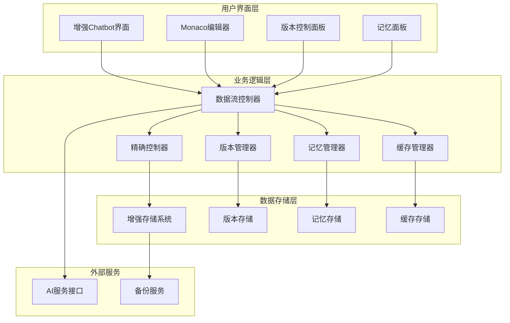

# 增强型Chatbot工作区交互系统 - 项目文档

## 📋 项目概述

这是一个基于现有Markdown简历编辑器的增强型Chatbot工作区交互系统，支持精确的内容控制、完整的版本管理和智能记忆功能。

### 🎯 核心目标

- **精确内容控制**: 支持段落、句子级别的精确编辑操作
- **智能版本管理**: 完整的版本控制、分支管理和回退功能  
- **记忆学习系统**: Chatbot智能记忆用户偏好和操作模式
- **无缝协作体验**: 用户手动编辑与AI辅助的无缝结合

### ✨ 主要特性

- ✅ 向后兼容现有系统
- ✅ 渐进式功能增强
- ✅ 高性能数据处理
- ✅ 智能缓存管理
- ✅ 可扩展架构设计

## 📚 文档结构

### 1. [系统设计文档](./enhanced-chatbot-system-design.md)
**完整的系统架构和设计方案**

- 🏗️ 系统架构概述
- 📊 核心数据结构设计
- 🔄 交互流程设计
- 🎛️ 功能特性详述
- ⚡ 性能优化策略
- 🔒 安全和可靠性
- 📅 实施计划

### 2. [API接口规范](./api-specifications.md)
**详细的API接口定义和使用示例**

- 🔧 版本控制API
- 🌿 分支管理API
- 🎯 精确操作API
- 🧠 记忆管理API
- 💾 缓存管理API
- 🔍 搜索和查询API
- 🤖 AI集成API
- 🛠️ 系统管理API

### 3. [实施指南](./implementation-guide.md)
**分阶段的详细实施方案**

- 📋 分阶段实施计划
- 🔨 具体实施步骤
- 🧪 测试策略
- 📈 性能测试
- 🚀 部署和运维
- 🔄 维护和扩展

## 🏗️ 系统架构图



## 🔄 核心交互流程

### 精确编辑流程

```mermaid
sequenceDiagram
    participant User as 用户
    participant UI as Chatbot界面
    participant Controller as 数据流控制器
    participant Precision as 精确控制器
    participant Version as 版本管理器
    
    User->>UI: 输入编辑指令
    UI->>Controller: 处理用户输入
    Controller->>Precision: 解析文档结构
    Precision->>Controller: 返回内容范围
    Controller->>UI: 显示可操作范围
    User->>UI: 选择操作类型
    UI->>Controller: 确认操作
    Controller->>Precision: 执行精确操作
    Precision->>Version: 创建新版本
    Version->>Controller: 返回版本信息
    Controller->>UI: 返回操作结果
    UI->>User: 显示编辑结果
```



## 🚀 快速开始

### 环境要求

- **Node.js**: 18+ 
- **浏览器**: Chrome 90+, Firefox 88+, Safari 14+
- **内存**: 最小 2GB RAM，推荐 4GB+
- **存储**: 本地存储至少 100MB 可用空间

### 安装和运行

```bash
# 1. 克隆项目
git clone <repository-url>
cd cv_ai_0818

# 2. 安装依赖
pnpm install

# 3. 启动开发服务器
pnpm dev
```

### 功能演示

1. **精确编辑**: 在编辑器中选择文本，使用Chatbot进行精确的段落或句子级编辑
2. **版本控制**: 查看版本历史，创建分支，回退到之前的版本
3. **智能建议**: 系统根据使用模式提供个性化的编辑建议
4. **记忆学习**: Chatbot学习用户习惯，提供更精准的操作建议

## 📊 核心数据结构

### 版本控制

```typescript
interface DocumentVersion {
  id: string                    // 版本唯一标识
  content: string              // 文档内容
  contentHash: string          // 内容哈希值
  timestamp: number            // 创建时间戳
  type: VersionType            // 版本类型
  metadata: VersionMetadata    // 版本元数据
  parentId?: string            // 父版本ID
  branchName: string           // 所属分支
}
```

### 精确操作

```typescript
interface ContentOperation {
  id: string                   // 操作唯一标识
  type: OperationType         // 操作类型 (keep/rewrite/delete/insert)
  rangeId: string             // 目标范围ID
  newContent?: string         // 新内容
  reason: string              // 操作原因
  confidence: number          // 信心度
}
```

### 智能记忆

```typescript
interface ChatMemory {
  id: string                   // 记忆唯一标识
  type: MemoryType            // 记忆类型
  content: MemoryContent      // 记忆内容
  timestamp: number           // 创建时间
  relevanceScore: number      // 相关性评分
  metadata: MemoryMetadata    // 记忆元数据
}
```

## 🎯 实施时间线

| 阶段 | 时间 | 主要任务 | 交付物 |
|------|------|----------|---------|
| **Phase 1** | Week 1-3 | 基础架构搭建 | 数据结构、存储系统、版本管理器 |
| **Phase 2** | Week 4-7 | 核心功能实现 | 精确控制器、记忆管理器、增强界面 |
| **Phase 3** | Week 8-10 | 高级特性开发 | 分支管理、智能建议、性能优化 |
| **Phase 4** | Week 11-12 | 测试和优化 | 测试套件、性能优化、部署准备 |

## 🔧 技术栈

### 前端技术
- **框架**: Nuxt 3 + Vue 3 + TypeScript
- **编辑器**: Monaco Editor
- **状态管理**: Pinia
- **存储**: IndexedDB + LocalForage
- **UI组件**: 自定义组件库

### 核心依赖
- **压缩**: LZ-String
- **加密**: Crypto-JS
- **diff算法**: 自实现
- **语义分析**: 自实现

## 📈 性能指标

### 响应时间目标
- **文档加载**: < 500ms (10MB文档)
- **版本切换**: < 200ms
- **精确操作**: < 100ms
- **AI响应**: < 3s (网络请求)

### 存储效率目标
- **压缩比率**: 平均 70% 压缩率
- **缓存命中率**: > 85%
- **内存使用**: < 50MB (正常使用)
- **本地存储**: < 10MB (单个简历)

## 🛡️ 安全和可靠性

### 数据保护
- ✅ 本地加密存储
- ✅ 数据完整性验证
- ✅ 隐私数据保护
- ✅ 访问权限控制

### 系统可靠性
- ✅ 优雅降级处理
- ✅ 自动错误恢复
- ✅ 完整操作日志
- ✅ 数据自动备份

## 🧪 测试策略

### 测试类型
- **单元测试**: 核心功能的单元测试覆盖
- **集成测试**: 组件间集成的测试验证
- **性能测试**: 系统性能和负载测试
- **用户测试**: 真实用户场景的测试

### 质量保证
- **代码覆盖率**: > 80%
- **性能基准**: 明确的性能指标
- **错误监控**: 实时错误追踪
- **用户反馈**: 持续用户体验改进

## 🔄 维护和支持

### 系统监控
- **性能监控**: 响应时间、内存使用、错误率
- **用户监控**: 用户活跃度、功能使用统计
- **数据监控**: 存储增长、缓存效率、同步状态

### 升级策略
- **向后兼容**: 新版本对老数据的兼容性
- **数据迁移**: 平滑的数据结构升级
- **功能渐进**: 新功能的渐进式发布
- **用户通知**: 及时的升级信息通知

## 🤝 贡献指南

### 开发规范
- **代码风格**: 统一的TypeScript/Vue代码规范
- **提交规范**: 规范的Git提交信息格式
- **文档要求**: 完整的代码注释和API文档
- **测试要求**: 新功能必须包含相应测试

### 参与方式
1. Fork项目仓库
2. 创建功能分支
3. 提交代码变更
4. 编写测试用例
5. 提交Pull Request

## 📞 支持和联系

### 技术支持
- **问题反馈**: 通过Issue系统提交
- **功能建议**: 欢迎提出改进建议
- **文档改进**: 帮助完善项目文档

### 团队联系
- **项目负责人**: [团队负责人]
- **技术负责人**: [技术负责人]
- **产品负责人**: [产品负责人]

---

## 📄 许可证

本项目采用 [MIT License](../LICENSE) 开源许可证。

---

**文档版本**: v1.0  
**最后更新**: 2024-01-21  
**项目状态**: 设计阶段  
**下一里程碑**: Phase 1 实施开始  

---

> 💡 **提示**: 这是一个完整的技术方案文档，包含了详细的设计、实施和维护指南。建议按照Phase划分进行渐进式实施，确保每个阶段的质量和稳定性。
