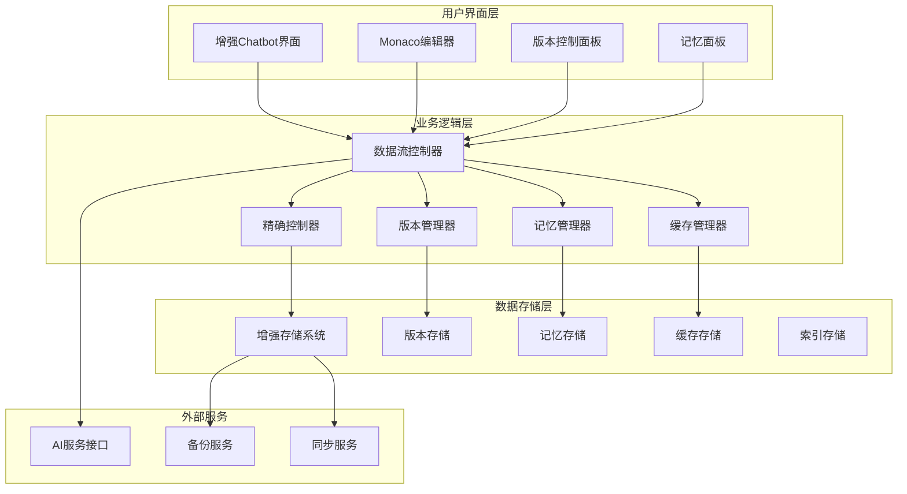
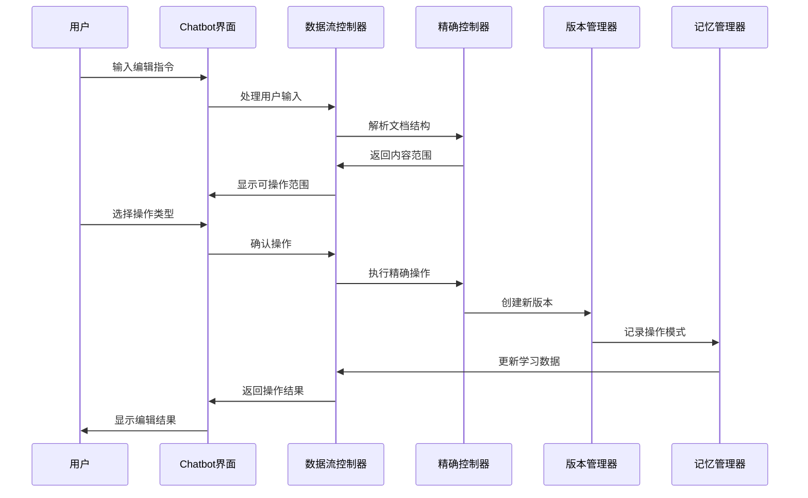
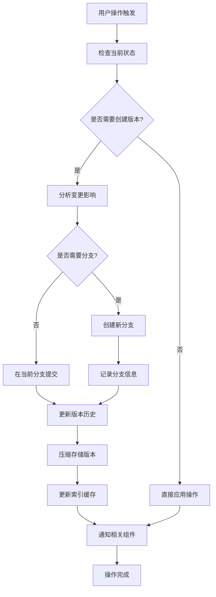
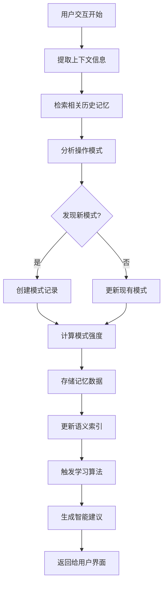

# 增强型Chatbot工作区交互系统设计文档

## 1. 系统概述

### 1.1 项目背景
基于现有的Markdown简历编辑器，设计并实现一个智能化的Chatbot与工作区交互系统，支持精确的内容控制、完整的版本管理和智能记忆功能。

### 1.2 核心目标
- **精确内容控制**：支持段落、句子级别的精确编辑操作
- **智能版本管理**：完整的版本控制、分支管理和回退功能
- **记忆学习系统**：Chatbot智能记忆用户偏好和操作模式
- **无缝协作体验**：用户手动编辑与AI辅助的无缝结合

### 1.3 系统特性
- ✅ 向后兼容现有系统
- ✅ 渐进式功能增强
- ✅ 高性能数据处理
- ✅ 智能缓存管理
- ✅ 可扩展架构设计

## 2. 系统架构

### 2.1 整体架构图



### 2.2 核心组件说明

#### 2.2.1 数据流控制器 (DataFlowController)
- **职责**：协调各个组件间的数据交互
- **功能**：操作流水线管理、事件分发、状态同步

#### 2.2.2 精确控制器 (PrecisionController)
- **职责**：处理文档的精确解析和操作
- **功能**：范围识别、操作验证、内容变更执行

#### 2.2.3 版本管理器 (VersionManager)
- **职责**：管理文档版本和分支
- **功能**：版本创建、分支管理、合并冲突解决

#### 2.2.4 记忆管理器 (MemoryManager)
- **职责**：管理Chatbot的学习和记忆
- **功能**：模式识别、偏好学习、上下文记忆

#### 2.2.5 缓存管理器 (CacheManager)
- **职责**：优化系统性能和响应速度
- **功能**：多层缓存、智能预加载、数据压缩

## 3. 核心数据结构

### 3.1 版本控制数据结构

```typescript
interface DocumentVersion {
  id: string                    // 版本唯一标识
  content: string              // 文档内容
  contentHash: string          // 内容哈希值
  timestamp: number            // 创建时间戳
  type: VersionType            // 版本类型
  metadata: VersionMetadata    // 版本元数据
  parentId?: string            // 父版本ID
  branchName: string           // 所属分支
}

interface ContentRange {
  id: string                   // 范围唯一标识
  type: RangeType             // 范围类型
  position: RangePosition     // 位置信息
  content: string             // 内容文本
  metadata: RangeMetadata     // 范围元数据
}

interface ContentOperation {
  id: string                   // 操作唯一标识
  type: OperationType         // 操作类型
  rangeId: string             // 目标范围ID
  newContent?: string         // 新内容
  reason: string              // 操作原因
  confidence: number          // 信心度
}
```

### 3.2 智能记忆数据结构

```typescript
interface ChatMemory {
  id: string                   // 记忆唯一标识
  type: MemoryType            // 记忆类型
  content: MemoryContent      // 记忆内容
  timestamp: number           // 创建时间
  relevanceScore: number      // 相关性评分
  metadata: MemoryMetadata    // 记忆元数据
}

interface UserPreference {
  category: PreferenceCategory // 偏好类别
  key: string                 // 偏好键名
  value: any                  // 偏好值
  strength: number            // 偏好强度
  frequency: number           // 使用频率
}

interface OperationPattern {
  sequence: string[]          // 操作序列
  frequency: number           // 出现频率
  successRate: number         // 成功率
  context: PatternContext     // 上下文信息
}
```

### 3.3 缓存管理数据结构

```typescript
interface CacheStructure {
  versions: VersionCache      // 版本缓存
  memories: MemoryCache       // 记忆缓存
  indexes: IndexCache         // 索引缓存
  metadata: CacheMetadata     // 缓存元数据
}

interface VersionCache {
  [versionId: string]: {
    content: string           // 缓存内容
    metadata: VersionMetadata // 版本元数据
    lastAccessed: number      // 最后访问时间
    compressed?: boolean      // 是否压缩
  }
}
```

## 4. 交互流程设计

### 4.1 精确编辑流程



### 4.2 版本控制流程



### 4.3 智能记忆流程



## 5. 功能特性详述

### 5.1 精确内容控制

#### 5.1.1 多层次范围识别
- **文档级别**：整个文档的全局操作
- **章节级别**：按标题划分的章节操作
- **段落级别**：独立段落的精确编辑
- **句子级别**：句子粒度的微调操作
- **短语级别**：关键词和短语的替换

#### 5.1.2 操作类型支持
- **保留 (Keep)**：保持内容不变
- **重写 (Rewrite)**：使用AI重新生成内容
- **删除 (Delete)**：移除指定内容
- **插入 (Insert)**：在指定位置添加内容
- **移动 (Move)**：内容位置调整
- **合并 (Merge)**：多个范围内容合并
- **拆分 (Split)**：单个范围内容拆分

#### 5.1.3 预览和验证
- **实时预览**：操作前显示预期效果
- **影响分析**：评估操作对整体文档的影响
- **冲突检测**：识别操作间的潜在冲突
- **安全检查**：防止破坏性操作

### 5.2 智能版本管理

#### 5.2.1 版本策略
- **自动版本**：重要操作后自动创建版本
- **手动版本**：用户主动创建版本快照
- **里程碑版本**：标记重要的文档状态
- **临时版本**：实验性修改的临时保存

#### 5.2.2 分支管理
- **主分支 (Main)**：文档的主要开发线
- **功能分支 (Feature)**：特定功能的开发分支
- **实验分支 (Experiment)**：尝试性修改的分支
- **备份分支 (Backup)**：重要状态的备份分支

#### 5.2.3 合并策略
- **自动合并**：无冲突的自动合并
- **手动合并**：用户手动解决冲突
- **AI辅助合并**：使用AI智能解决冲突
- **选择性合并**：Cherry-pick特定变更

### 5.3 智能记忆系统

#### 5.3.1 记忆类型
- **对话记忆**：用户与Chatbot的交互历史
- **操作记忆**：用户的编辑操作模式
- **偏好记忆**：用户的个人偏好设置
- **上下文记忆**：特定场景下的行为模式

#### 5.3.2 学习机制
- **模式识别**：识别用户常用的操作序列
- **偏好学习**：学习用户的编辑习惯
- **上下文关联**：建立操作与上下文的关联
- **反馈学习**：从用户反馈中持续改进

#### 5.3.3 智能建议
- **操作建议**：基于历史模式的操作建议
- **内容建议**：基于上下文的内容补全
- **格式建议**：符合用户习惯的格式调整
- **优化建议**：文档结构和内容的优化建议

## 6. 性能优化策略

### 6.1 缓存策略

#### 6.1.1 多层缓存架构
- **内存缓存**：最常访问数据的内存存储
- **本地缓存**：浏览器本地存储缓存
- **压缩缓存**：大数据的压缩存储
- **预测缓存**：基于使用模式的预加载

#### 6.1.2 缓存更新策略
- **增量更新**：只更新变更的部分
- **懒加载**：按需加载数据
- **后台更新**：异步更新缓存数据
- **智能失效**：基于使用频率的缓存失效

### 6.2 数据压缩

#### 6.2.1 版本压缩
- **差异存储**：只存储版本间的差异
- **内容去重**：相同内容的引用存储
- **压缩算法**：使用高效的压缩算法
- **分块存储**：大文档的分块压缩存储

#### 6.2.2 索引优化
- **倒排索引**：快速文本搜索
- **语义索引**：基于语义相似度的索引
- **时间索引**：基于时间的快速检索
- **复合索引**：多维度的复合查询索引

### 6.3 异步处理

#### 6.3.1 操作队列
- **优先级队列**：基于重要性的操作排序
- **批量处理**：相似操作的批量执行
- **并行处理**：独立操作的并行执行
- **错误恢复**：失败操作的自动重试

#### 6.3.2 后台任务
- **索引更新**：后台更新搜索索引
- **缓存预热**：预加载可能需要的数据
- **垃圾回收**：清理过期和无用数据
- **数据同步**：后台同步到远程存储

## 7. 安全和可靠性

### 7.1 数据安全

#### 7.1.1 数据保护
- **本地加密**：敏感数据的本地加密存储
- **访问控制**：基于权限的数据访问控制
- **数据校验**：数据完整性验证
- **隐私保护**：用户隐私数据的保护

#### 7.1.2 操作安全
- **操作验证**：危险操作的二次确认
- **回滚机制**：错误操作的快速回滚
- **权限检查**：操作权限的实时检查
- **操作日志**：完整的操作审计日志

### 7.2 系统可靠性

#### 7.2.1 错误处理
- **优雅降级**：功能不可用时的降级处理
- **错误恢复**：自动错误恢复机制
- **用户通知**：友好的错误信息提示
- **诊断工具**：问题诊断和调试工具

#### 7.2.2 数据备份
- **自动备份**：定期自动数据备份
- **版本备份**：重要版本的永久备份
- **增量备份**：高效的增量备份策略
- **备份验证**：备份数据的完整性验证

## 8. 实施计划

### 8.1 开发阶段

#### Phase 1: 基础架构 (2-3周)
- ✅ 设计和实现核心数据结构
- ✅ 创建基础的版本控制框架
- ✅ 实现文档精确解析功能
- ✅ 建立基础的缓存管理系统

#### Phase 2: 核心功能 (3-4周)
- ✅ 实现精确内容操作功能
- ✅ 集成版本控制到现有系统
- ✅ 开发智能记忆管理功能
- ✅ 创建增强的Chatbot界面

#### Phase 3: 高级特性 (2-3周)
- ✅ 实现分支管理和合并功能
- ✅ 开发智能建议系统
- ✅ 优化性能和用户体验
- ✅ 添加高级搜索和过滤功能

#### Phase 4: 测试优化 (1-2周)
- ✅ 全面的功能测试
- ✅ 性能优化和调试
- ✅ 用户体验改进
- ✅ 文档完善和部署准备

### 8.2 质量保证

#### 8.2.1 测试策略
- **单元测试**：核心功能的单元测试覆盖
- **集成测试**：组件间集成的测试验证
- **用户测试**：真实用户场景的测试
- **性能测试**：系统性能和负载测试

#### 8.2.2 代码质量
- **代码规范**：统一的代码风格和规范
- **代码审查**：关键代码的同行审查
- **文档完整**：完整的技术文档和注释
- **重构优化**：持续的代码重构和优化

## 9. 维护和支持

### 9.1 系统监控

#### 9.1.1 性能监控
- **响应时间**：关键操作的响应时间监控
- **内存使用**：内存使用情况的实时监控
- **错误率**：系统错误率的统计和分析
- **用户活跃度**：用户使用情况的统计分析

#### 9.1.2 数据监控
- **数据增长**：存储数据增长趋势监控
- **缓存效率**：缓存命中率和效率监控
- **同步状态**：数据同步状态的监控
- **备份状态**：数据备份完整性监控

### 9.2 升级维护

#### 9.2.1 版本升级
- **向后兼容**：新版本对老数据的兼容性
- **数据迁移**：数据结构升级的迁移策略
- **功能渐进**：新功能的渐进式发布
- **用户通知**：升级信息的用户通知机制

#### 9.2.2 技术支持
- **问题诊断**：快速问题定位和诊断工具
- **用户帮助**：完整的用户帮助文档
- **社区支持**：用户社区和技术支持
- **持续改进**：基于用户反馈的持续改进

## 10. 技术规格

### 10.1 系统要求

#### 10.1.1 前端要求
- **浏览器支持**：Chrome 90+, Firefox 88+, Safari 14+
- **JavaScript**：ES2020+ 支持
- **内存要求**：最小 2GB RAM，推荐 4GB+
- **存储空间**：本地存储至少 100MB 可用空间

#### 10.1.2 技术栈
- **框架**：Nuxt 3 + Vue 3
- **编辑器**：Monaco Editor
- **状态管理**：Pinia
- **存储**：LocalForage + IndexedDB
- **UI组件**：自定义组件库

### 10.2 性能指标

#### 10.2.1 响应时间
- **文档加载**：< 500ms (10MB文档)
- **版本切换**：< 200ms
- **精确操作**：< 100ms
- **AI响应**：< 3s (网络请求)

#### 10.2.2 存储效率
- **压缩比率**：平均 70% 压缩率
- **缓存命中率**：> 85%
- **内存使用**：< 50MB (正常使用)
- **本地存储**：< 10MB (单个简历)

---

## 附录

### A. API接口规范
详见独立的API文档

### B. 数据库Schema
详见数据结构设计文档

### C. 部署指南
详见部署和运维文档

### D. 故障排除
详见故障排除和调试指南

---

**文档版本**: v1.0  
**最后更新**: 2024-01-21  
**维护团队**: 前端开发团队  
**审核状态**: 待审核  
